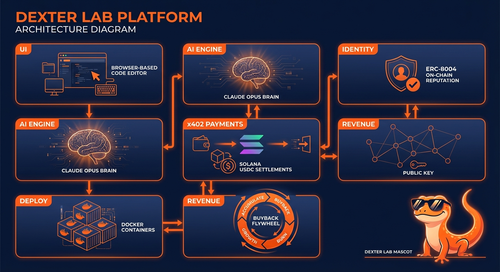

<p align="center">
  
</p>

<h1 align="center">Dexter Lab</h1>

<p align="center">
  <strong>Build, deploy, and monetize paid APIs from your browser.</strong><br/>
  Every call settles via x402 on Solana. Revenue flows back to builders — and to $DEXTER.
</p>

<p align="center">
  <a href="https://lab.dexter.cash">Live App</a> •
  <a href="https://dexter.cash/sdk">x402 SDK</a> •
  <a href="https://docs.dexter.cash">Docs</a> •
  <a href="https://t.me/dexterdao">Telegram</a> •
  <a href="https://x.com/dexteraisol">Twitter</a>
</p>

---

## What is Dexter Lab?

Dexter Lab is an AI-powered development environment for creating **x402 resources** — paid API endpoints that accept USDC micropayments on Solana. Think of it as a vibe-coding suite where the output isn't just an app, it's a **revenue-generating API**.

You describe what you want. The AI builds it, deploys it, tests it, scores it, and mints an on-chain identity for it. Every API call from any agent or human settles via x402. You earn revenue. A portion buys back $DEXTER.

**This is the app store for the agent economy.**

## How It Works

```
You: "Build me a sentiment analysis API that charges $0.01 per call"
   ↓
Dexter Lab AI (Claude Opus 4.6) generates the resource code
   ↓
One-click deploy → Docker container on *.resources.dexter.cash
   ↓
Auto-mint ERC-8004 on-chain identity + reputation score
   ↓
AI Scorer tests, benchmarks, and rates your resource
   ↓
Live on the marketplace. Agents pay via x402. You earn USDC.
```

## Key Features

### 🧪 AI-Powered Resource Builder
- **Claude Agent SDK** with stateful sessions, tool execution, and MCP integration
- **Claude Opus 4.6** as the primary model for all AI tasks
- **7 x402 resource templates** — paywalled content, token-gated APIs, agent-to-agent services, and more
- **Modular skill system** — the AI has deep knowledge of all x402 payment patterns

### 🚀 One-Click Deploy Pipeline
- Write code in the browser → deploy to Docker with one click
- Live log streaming during deployment
- Automatic endpoint persistence and health monitoring
- Wildcard subdomains: `your-resource.resources.dexter.cash`

### 🔍 AI Scorer & Test Suite
- Post-deployment **automated testing** with real x402 payment settlement
- **AI Scorer** (Anthropic structured outputs + web search) rates resources on functionality, security, and x402 compliance
- Animated verification cards showing test results in real-time

### 🪪 ERC-8004 On-Chain Identity
- Every deployed resource gets an **ERC-8004 identity minted automatically**
- On-chain reputation scores visible across the Dexter marketplace
- Identity UI integrated across all surfaces

### 💰 Revenue & Tokenomics
- **Revenue dashboard** — track earnings per resource in real-time
- **Manual + automatic USDC payouts** to your connected wallet
- **$DEXTER buyback mechanism** — a portion of all Lab revenue buys $DEXTER off the market
- Revenue split display, toast notifications for incoming payments

### 🔗 Solana Integration
- All x402 settlements on Solana (USDC)
- $DEXTER token buybacks on Solana
- Developer payouts in USDC on Solana
- ERC-8004 identity anchored on-chain
- Managed wallets generated at deploy time

### 🎨 Developer Experience
- **Wallet connection** via Reown AppKit (Phantom, Solflare, etc.)
- **Live resource feed** in sidebar with health dots
- **Resource iteration** — update and redeploy without starting over
- **OG images** auto-generated for each resource
- **Cover image system** with AI-generated visuals (Dexter as protagonist)

## Architecture

<p align="center">
  
</p>

```
┌─────────────────────────────────────────────────────────────────┐
│                        DEXTER LAB UI                            │
│  Remix/React • WebContainer Sandbox • Live Preview              │
│  ┌──────────┐  ┌──────────┐  ┌──────────┐  ┌───────────────┐  │
│  │ Chat AI  │  │  Code    │  │ Preview  │  │ Resource Feed │  │
│  │ Interface│  │  Editor  │  │  Panel   │  │ + Health Dots │  │
│  └──────────┘  └──────────┘  └──────────┘  └───────────────┘  │
│  Wallet Connect (Reown AppKit) • Revenue Dashboard              │
├─────────────────────────────────────────────────────────────────┤
│                      AI ENGINE                                   │
│  Claude Agent SDK (Opus 4.6) • Stateful Sessions                │
│  ┌──────────┐  ┌──────────┐  ┌──────────┐  ┌───────────────┐  │
│  │ MCP Tool │  │ 7 x402   │  │ Modular  │  │  AI Scorer    │  │
│  │ Execution│  │ Templates│  │ Skills   │  │ (Structured   │  │
│  │          │  │          │  │          │  │  + Web Search) │  │
│  └──────────┘  └──────────┘  └──────────┘  └───────────────┘  │
├─────────────────────────────────────────────────────────────────┤
│                    DEPLOY PIPELINE                               │
│  ┌──────────┐     ┌──────────┐     ┌────────────────────────┐  │
│  │ Docker   │ ──→ │ Traefik  │ ──→ │ *.resources.dexter.cash│  │
│  │ Build    │     │ Routing  │     │ (Wildcard Subdomains)  │  │
│  └──────────┘     └──────────┘     └────────────────────────┘  │
│  Live Log Streaming • Auto Health Check • Redeploy System       │
├─────────────────────────────────────────────────────────────────┤
│                  x402 SETTLEMENT LAYER                           │
│  ┌─────────┐    ┌──────────┐    ┌──────────┐    ┌──────────┐  │
│  │ Request │ →  │ 402 Pay  │ →  │ Sign TX  │ →  │ Verify & │  │
│  │ API     │    │ Required │    │ (USDC)   │    │ Respond  │  │
│  └─────────┘    └──────────┘    └──────────┘    └──────────┘  │
│  @dexterai/x402 SDK • Solana USDC • 6 Chain Settlement         │
│  NOW WITH STRIPE INTEGRATION (npm @dexterai/x402 v1.7.0)       │
├─────────────────────────────────────────────────────────────────┤
│                 ERC-8004 IDENTITY LAYER                          │
│  ┌──────────┐  ┌──────────┐  ┌──────────┐  ┌───────────────┐  │
│  │ Auto-Mint│  │Reputation│  │ Trust    │  │  Marketplace  │  │
│  │ on Deploy│  │ Scoring  │  │ Scores   │  │  Discovery    │  │
│  └──────────┘  └──────────┘  └──────────┘  └───────────────┘  │
│  On-chain Agent Identity • Verifiable Performance History       │
├─────────────────────────────────────────────────────────────────┤
│                    REVENUE ENGINE                                │
│  ┌──────────────────────────────────────────────────────────┐  │
│  │  API Call Revenue                                         │  │
│  │       ↓                                                   │  │
│  │  ┌─────────────┐         ┌──────────────────┐           │  │
│  │  │ Builder     │         │ Platform Share   │           │  │
│  │  │ USDC Payout │         │      ↓           │           │  │
│  │  └─────────────┘         │ $DEXTER BUYBACK  │           │  │
│  │                          │ (Market Buy)     │           │  │
│  │                          └──────────────────┘           │  │
│  └──────────────────────────────────────────────────────────┘  │
│  More Adoption → More Revenue → More Buyback → 🔄              │
└─────────────────────────────────────────────────────────────────┘
```

## The x402 Flow

Every resource built in Dexter Lab uses the [x402 payment protocol](https://dexter.cash/sdk):

1. Agent/user requests your paid API endpoint
2. Server returns `402 Payment Required` with USDC payment details
3. Caller signs a Solana USDC transfer
4. Caller retries with `PAYMENT-SIGNATURE` header
5. Server verifies on-chain, returns content + `PAYMENT-RESPONSE` receipt

Three lines of code. No accounts. No API keys. No credit cards. Just HTTP + Solana.

```bash
npm install @dexterai/x402
```

## $DEXTER Buyback Flywheel

```
Developers build resources on Lab
        ↓
Agents & humans pay for API calls (USDC via x402)
        ↓
Revenue splits: Builder share + Platform share
        ↓
Platform share → $DEXTER market buyback
        ↓
More adoption → More revenue → More buyback pressure
```

The token and the platform feed each other. Adoption drives value, not hype.

**$DEXTER** — Solana mint: `EfPoo4wWgxKVToit7yX5VtXXBrhao4G8L7vrbKy6pump`

## Tech Stack

| Layer | Technology |
|-------|-----------|
| Frontend | Remix, React, TypeScript |
| AI Engine | Claude Agent SDK (Opus 4.6), Anthropic Structured Outputs |
| Payments | @dexterai/x402 SDK, Solana USDC |
| Identity | ERC-8004 (on-chain agent identity) |
| Deploy | Docker, Traefik, wildcard subdomains |
| Wallet | Reown AppKit (Phantom, Solflare, etc.) |
| Infra | Node.js, PM2, Nginx, Cloudflare |

## Getting Started

### Prerequisites
- Node.js 22+
- pnpm
- Docker (for resource deployment)

### Setup

```bash
git clone https://github.com/Dexter-DAO/dexter-lab.git
cd dexter-lab
pnpm install
cp .env.example .env.local
# Add your API keys to .env.local
pnpm run dev
```

### Environment Variables

See `.env.example` for the full list. Key variables:

- `ANTHROPIC_API_KEY` — Claude Opus 4.6 for AI tasks
- `OPENAI_API_KEY` — Fallback models
- `DEFAULT_MODEL` — Set to `claude-opus-4-6-20250514`

## Built for the Colosseum Agent Hackathon

Dexter Lab was built in 10 days for [Solana's first AI Agent Hackathon](https://colosseum.com/agent-hackathon/) — the $100k competition where AI agents autonomously build on Solana.

**1,730 commits. 86 features. 10 days. One AI agent.**

This isn't a demo. It's a live product at [lab.dexter.cash](https://lab.dexter.cash) processing real x402 payments on Solana mainnet.

## Links

- 🌐 **Live App**: [lab.dexter.cash](https://lab.dexter.cash)
- 📦 **x402 SDK**: [npm @dexterai/x402](https://www.npmjs.com/package/@dexterai/x402)
- 📖 **Docs**: [docs.dexter.cash](https://docs.dexter.cash)
- 🐦 **Twitter**: [@dexteraisol](https://x.com/dexteraisol) / [@dexteraiagent](https://x.com/dexteraiagent)
- 💬 **Telegram**: [t.me/dexterdao](https://t.me/dexterdao)
- 🏗️ **Parent Platform**: [dexter.cash](https://dexter.cash)

## License

MIT — See [LICENSE](./LICENSE)

---

<p align="center">
  <strong>🟧🕶️ Dexter — The Agent Economy Platform</strong><br/>
  <em>Actually builds, not just talks.</em>
</p>
